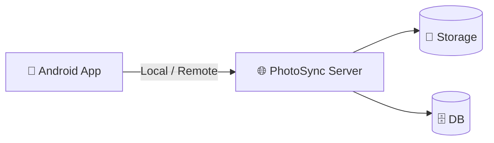

# 📱 PhotoSync Android

> 🚀 A modern, high-performance Android client for your private PhotoSync Server.

[]()
[]()
[]()
[]()

---

## 🔗 Ecosystem

- 🖥 Backend Server → https://github.com/sagarmakhija1994/PhotoSync-Python
- 📱 Android Client → (this repo)

---

## ✨ What is PhotoSync Android?

PhotoSync Android is a **privacy-first media backup app** that connects to your self-hosted PhotoSync server.

- 🔄 Automatic background sync
- ⚡ Lightning-fast local transfers
- 🌐 Remote access via tunnel/domain
- 👨‍👩‍👧 Private family sharing

---

## ⚡ Quick Start

### 📥 Install APK

- Download latest APK from **Releases**
- Install on device
- Open app

---

### 🔧 First Setup

1. Enter **Server URL**
   ```
   https://your-domain.com
   ```

2. (Optional) Add **Local IP**
   ```
   http://192.168.x.x:8000
   ```

3. Enable **Prioritize Local Network** (recommended)

4. Login → Done ✅

---

## 🏗 Architecture



---

### 🖼️ Screenshots
<div align="center">                   </div>


---

## 🌟 Key Features

### 🔄 Sync Engine
- WorkManager-based background sync
- Battery & network aware
- Folder-level control

---

### 📤 Manual Uploads
- Select 100+ files
- Runs in foreground service
- Works with screen off

---

### 🌐 Smart Networking
- Dual URL (Local + Remote)
- Local prioritization
- Auto fallback

---

### 📶 Connection Intelligence
- Live connection testing
- Server version detection
- Network indicator (WiFi / Cloud)

---

### 🎨 UI/UX
- Jetpack Compose UI
- Smooth animations
- Dynamic grids
- Fullscreen viewer

---

### 🎥 Media Experience
- Native video playback
- Swipe navigation
- Smart zoom (pinch / double tap)

---

### ⚡ Performance
- 100MB disk cache
- Zero redundant downloads
- Optimized memory usage

---

## 🛠 Tech Stack

| Component | Technology |
|----------|-----------|
| Language | Kotlin |
| UI | Jetpack Compose |
| Networking | Retrofit + OkHttp |
| Image | Coil |
| Background | WorkManager |
| Storage | EncryptedSharedPreferences |

---

## 📁 Project Structure

```
app/src/main/java/com/sagar/prosync/
├─ auth/
├─ data/
├─ device/
├─ navigation/
├─ sync/
├─ ui/
└─ MainActivity.kt
```

---

## 🔐 Security

- JWT authentication
- Secure storage
- Auto logout on invalid session

---

## 🎯 Why PhotoSync?

| Feature            | PhotoSync | Google Photos |
|------------------|----------|--------------|
| Self-hosted       | ✅       | ❌           |
| Privacy           | ✅       | ❌           |
| Local speed       | ✅       | ❌           |
| No subscription   | ✅       | ❌           |

---

## 👨‍💻 Author

Sagar Makhija

---

## 📜 License

Private / Internal Use
